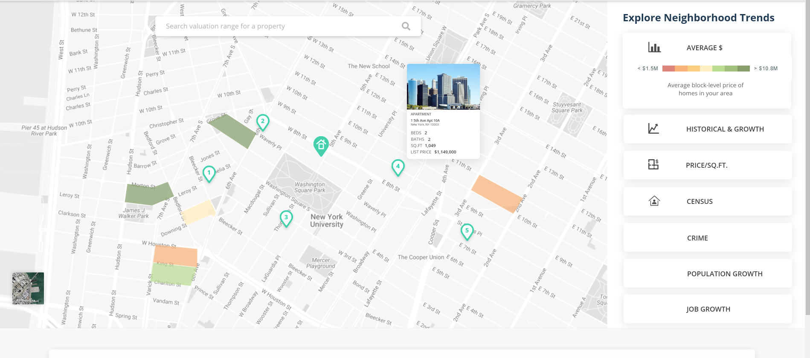

#Assignment description

In this repo you have **design.png** file that shows the functionality needed for this assignment. Also there are two other files to help you get started **mapPage.html** and **mapPage.css**. You should build a map page that looks similarly as the page on **design.png**.

 Focus for this assignment is exclusively on functionality, clean and reusable code in React and Redux.
 
If you have your own boilerplate feel free to use it otherwise you can use create react app or any other boilerplate.

When submitting the assignment please provide us with information how much time you spent on it. If for some reason you are not able to resolve all tasks from the list submit the ones you did. 

If you have any questions feel free to contact us at **ljerinic@iolap.com**

###Deliverables

1. Create a map that shows few pinned locations (data should be mocked). One property has to be marked as main property and others as nearby. See the design.png image.
2. When user hover on the pin he should see some basic property data in modal
3. When user clicks on one of the filters that are located in right sidebar you have to apply a layer that colors certain areas on the map (it does not matter which areas are highlighted you can just mock this data)
4. When user clicks on button we should somehow "mark" this button so that user knows which filter is applied.
5. Only one filer can be applied 
6. Filters should be set in url so that we can have a "shareable link"
7. You should use leaflet js library...by either porting it to React or use existing react wrapper (link in references)

###Bonus points - not mandatory
1. Custom boilerplate for React app
2. Custom boilerplate or implementations for reducing Redux boilerplate
3. Use one of css in js implementations. Note that css provided is in bootstrap.
4. Clean git history with meaningful commit messages

###References

[react-leaflet](https://react-leaflet.js.org/)

[leaflet js](https://leafletjs.com/)